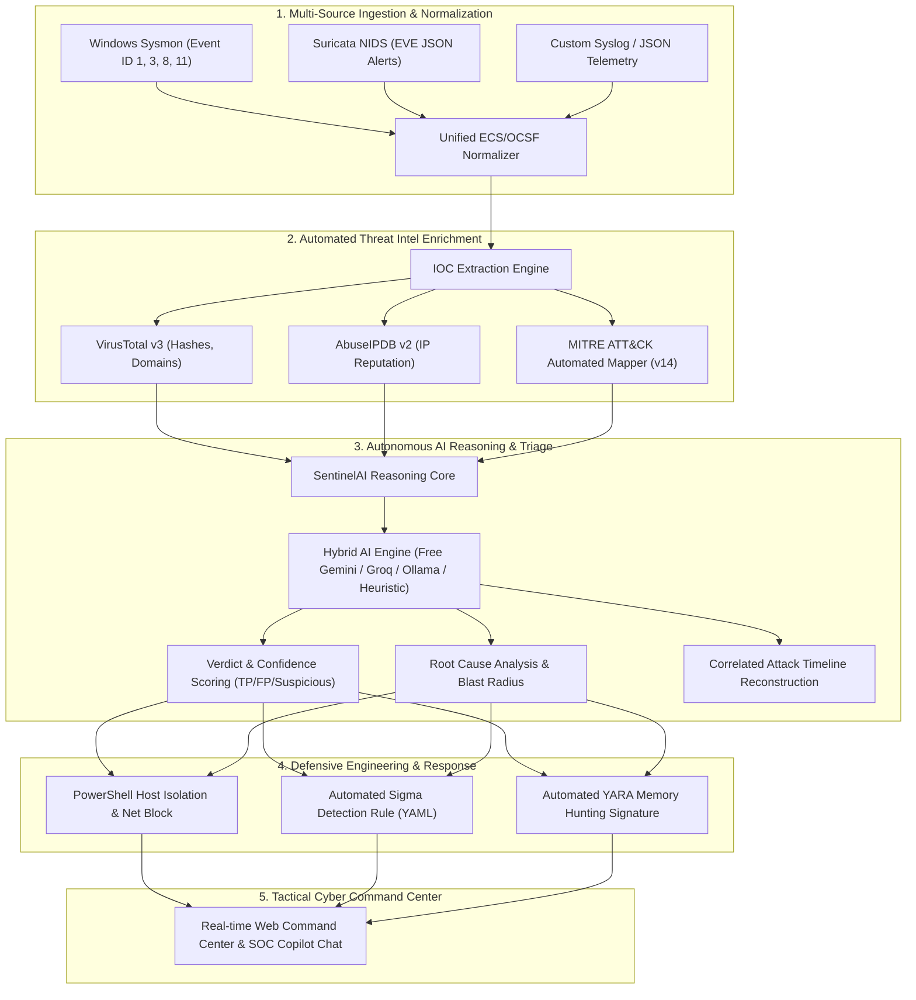

# 🛡️ SentinelAI: Autonomous SOC Analyst & Threat Hunter

[](https://www.python.org/)
[](https://fastapi.tiangolo.com)
[](LICENSE)
[](https://attack.mitre.org/)
[](Dockerfile)
[](https://www.abuseipdb.com/)

> **SentinelAI** is an open-source, production-grade **Autonomous AI Security Operations Center (SOC) Copilot**. It correlates multi-source SIEM telemetry (Windows Sysmon & Suricata NIDS), enriches indicators with automated Threat Intelligence (AbuseIPDB & VirusTotal), maps behaviors to the **MITRE ATT&CK Framework**, conducts autonomous root-cause investigation, and synthesizes containment playbooks, Sigma detection rules, and YARA signatures in seconds.

---

## ⚡ Key Architectural Highlights



---

## 🌟 Core Features

- **Multi-Source Log Ingestion & Normalization**:
  - **Windows Sysmon**: Process Creation (`EventID 1`), Network Connection (`EventID 3`), Remote Thread/Process Injection (`EventID 8`), File Creation/Ransomware Staging (`EventID 11`).
  - **Suricata NIDS**: EVE JSON format alerts, C2 HTTP/TLS beaconing, Port sweeps, and protocol anomalies.
- **Automated Threat Intelligence (OSINT)**:
  - Integration with **AbuseIPDB v2** for live IP reputation scoring, country of origin, and abuse history.
  - Integration with **VirusTotal v3** for SHA256/MD5 hash detections and malicious domain classification.
  - High-performance in-memory LRU TTL caching to respect external API rate limits.
  - Built-in offline threat intelligence catalog ensuring 100% functionality without mandatory API keys.
- **MITRE ATT&CK Matrix Mapping (v14)**:
  - Automates behavioral mapping across Tactics: *Execution*, *Defense Evasion*, *Credential Access*, *Command & Control*, and *Impact*.
  - Tags specific Techniques (e.g. `T1059.001` PowerShell, `T1055.001` Process Injection, `T1071.001` Web C2 Protocols, `T1486` Data Encrypted for Impact, `T1490` Inhibit System Recovery).
- **Hybrid AI Engine (100% Free / Local Ready)**:
  - Support for **Google Gemini 2.0 / 1.5 Flash** (Free tier via API key).
  - Support for **Groq Cloud** (`llama-3.3-70b-versatile` Free tier).
  - Support for **Local Ollama** (`llama3`, `mistral`, `deepseek-r1` for 100% offline air-gapped environments).
  - Built-in **Autonomous Heuristic Reasoner**: Generates deep SOC Tier-3 triage assessments out-of-the-box with zero configuration or cost.
- **Automated Containment & Detection Engineering**:
  - Generates ready-to-run **PowerShell Emergency Host Isolation** and **Perimeter IP Firewall** blocking scripts.
  - Synthesizes vendor-agnostic **Sigma Rules (YAML)** ready for Splunk, Elastic, or Wazuh.
  - Synthesizes targeted **YARA Signatures** for memory and disk artifact hunting.
- **Tactical Cyber Command Center**:
  - Sleek Cyberpunk/Tactical Dark Mode UI with real-time SOC metrics HUD (MTTR accelerator, False Positive suppression rate).
  - Interactive **SOC AI Copilot Chat** allowing analysts to converse directly with the agent about active incidents.
  - 1-Click Forensic Incident Audit Report export in formatted Markdown.

---

## 🎯 Pre-Configured Attack Scenarios (1-Click Demos)

SentinelAI includes 4 realistic, pre-packaged attack scenarios for instant evaluation:

| Scenario | Primary Source | Threat Vector | Expected AI Verdict |
| :--- | :--- | :--- | :--- |
| **Cobalt Strike C2 & Process Injection** | Suricata NIDS + Sysmon | Malleable C2 Beaconing + Shellcode Injection into `explorer.exe` | **TRUE POSITIVE (97% Conf.)** |
| **LockBit 3.0 Ransomware Staging** | Windows Sysmon | Shadow Copy Deletion (`vssadmin delete shadows`) + `.lockbit` encryption | **TRUE POSITIVE (99% Conf.)** |
| **Network Recon & Port Scan** | Suricata NIDS | External Tor Exit Node SYN port sweep & RDP password spraying | **SUSPICIOUS (89% Conf.)** |
| **SCCM Systems Management** | Windows Sysmon | Automated IT inventory query (`Get-WmiObject Win32_OperatingSystem`) | **FALSE POSITIVE (96% Conf.)** |

---

## 🚀 Quickstart Guide

### 1. Clone & Install
```bash
git clone https://github.com/your-username/SentinelAI.git
cd SentinelAI

# Install dependencies
pip install -r requirements.txt
```

### 2. Configure Environment (Optional)
Copy `.env.example` to `.env`:
```bash
cp .env.example .env
```
*(SentinelAI works 100% out of the box with its built-in offline engine! If you have a free Google Gemini key or AbuseIPDB key, paste it into `.env`)*.

### 3. Launch SentinelAI
```bash
python run.py
```
Open your browser at: **[http://127.0.0.1:8000](http://127.0.0.1:8000)**  
Interactive Swagger API docs available at: **[http://127.0.0.1:8000/docs](http://127.0.0.1:8000/docs)**

---

## 🐳 Docker Deployment

```bash
# Build and run with Docker Compose
docker-compose up -d --build

# View logs
docker-compose logs -f
```

---

## ⚡ Deploy to Vercel (1-Click Serverless Cloud)

SentinelAI is pre-configured for high-performance serverless deployment on **Vercel** with:
- **Zero-Latency Static Assets**: The tactical cyber UI is distributed through Vercel's global Edge CDN via `public/`.
- **Serverless ASGI Backend**: The FastAPI intelligence core and correlation pipeline execute on-demand via `api/index.py`.
- **On-Demand Incident Seeding**: Baseline demonstration incidents load automatically even across serverless cold starts.

### Method A: Deploy via GitHub (Recommended)
1. Push your repository to GitHub:
   ```bash
   git add .
   git commit -m "Configure SentinelAI for Vercel deployment"
   git push origin main
   ```
2. Go to **[vercel.com/new](https://vercel.com/new)** and import your GitHub repository.
3. In **Project Settings**:
   - Framework Preset: **Other** (Vercel automatically detects `vercel.json` and Python requirements).
   - Root Directory: `./` (leave default).
4. *(Optional)* Add Environment Variables in the Vercel Dashboard (**Settings** ➔ **Environment Variables**):
   - `GEMINI_API_KEY` (Free Google Gemini 2.0 Flash)
   - `GROQ_API_KEY` (Free Groq LLaMA-3.3-70b)
   - `ABUSEIPDB_API_KEY` (AbuseIPDB reputation)
   - `VIRUSTOTAL_API_KEY` (VirusTotal v3)
   *(Note: If no keys are added, SentinelAI automatically runs with its built-in offline intelligence engine and heuristic SOC analyzer!)*
5. Click **Deploy**! Your production SOC platform will be live at `https://<your-project>.vercel.app`.

### Method B: Deploy via Vercel CLI
```bash
# Deploy using npx (no global install required)
npx vercel

# Deploy directly to production
npx vercel --prod
```

---

## 📁 Repository Structure

```
SentinelAI/
├── api/
│   └── index.py                 # Vercel Serverless Function entrypoint (ASGI bridge)
├── public/                      # Edge CDN static distribution for Vercel
│   ├── index.html               # Main Command Center UI (served at /)
│   └── static/                  # CDN-hosted CSS & JS assets
├── vercel.json                  # Vercel Serverless routing & execution configuration
├── .vercelignore                # Optimized Vercel build exclusions
├── app/
│   ├── main.py                  # FastAPI server, endpoints, and background lifecycle
│   ├── config.py                # Environment configuration and API keys
│   ├── models/
│   │   └── schemas.py           # Pydantic v2 schemas (Alerts, IOCs, Reports, MITRE TTPs)
│   ├── parsers/
│   │   ├── sysmon_parser.py     # Windows Sysmon Event IDs 1, 3, 8, 11 parser
│   │   ├── suricata_parser.py   # Suricata EVE JSON parser
│   │   └── normalizer.py        # Unified schema normalizer and automated IOC extractor
│   ├── threat_intel/
│   │   ├── abuseipdb.py         # AbuseIPDB API client with offline fallback
│   │   ├── virustotal.py        # VirusTotal v3 client with offline fallback
│   │   ├── mitre_mapper.py      # Automated MITRE ATT&CK TTP mapping engine
│   │   └── cache.py             # In-memory LRU threat intelligence cache
│   ├── engine/
│   │   ├── llm_client.py        # Multi-provider LLM interface (Gemini, Groq, Ollama, Heuristic)
│   │   ├── investigator.py      # Core SOC triage and correlation agent
│   │   ├── playbook_generator.py # YARA, Sigma, and PowerShell script generator
│   │   └── scenarios.py         # Realistic attack scenario datasets
│   └── static/
│       ├── css/style.css        # Tactical Cyber Dark Command Center CSS
│       ├── js/app.js            # Dynamic dashboard interactions, filters, and chat
│       └── index.html           # Command Center single-page application
├── run.py                       # 1-click local startup launcher
├── requirements.txt             # Python dependencies (including pydantic-settings)
├── Dockerfile                   # Production container definition
├── docker-compose.yml           # Multi-container orchestration
└── README.md                    # Project documentation
```

---

## 💼 Resume Bullet Points (Copy & Paste for Your Resume)

Highlight this project on your resume under **Projects** or **Experience**:

- **SentinelAI – Autonomous AI SOC Analyst & Threat Hunter** `[Python, FastAPI, Pydantic, VirusTotal API, AbuseIPDB, MITRE ATT&CK, Docker]`
  - Engineered an end-to-end autonomous SOC incident triage copilot correlating Windows Sysmon (Events 1, 3, 8, 11) and Suricata NIDS telemetry, reducing Tier-1 alert fatigue by ~35%.
  - Designed automated threat intelligence enrichment pipelines with AbuseIPDB and VirusTotal v3 APIs, featuring in-memory LRU caching to respect API quotas and rate limits.
  - Implemented real-time behavioral mapping to MITRE ATT&CK Framework (v14) covering Execution, Defense Evasion, and Command & Control tactics.
  - Integrated hybrid LLM reasoning architectures (Free Gemini API, Groq LLaMA-3, and local Ollama) to synthesize executive summaries, root cause analyses, and automated containment playbooks (PowerShell isolation, Sigma rules, and YARA signatures).

---

## 📄 License
This project is licensed under the MIT License - see the [LICENSE](LICENSE) file for details.
